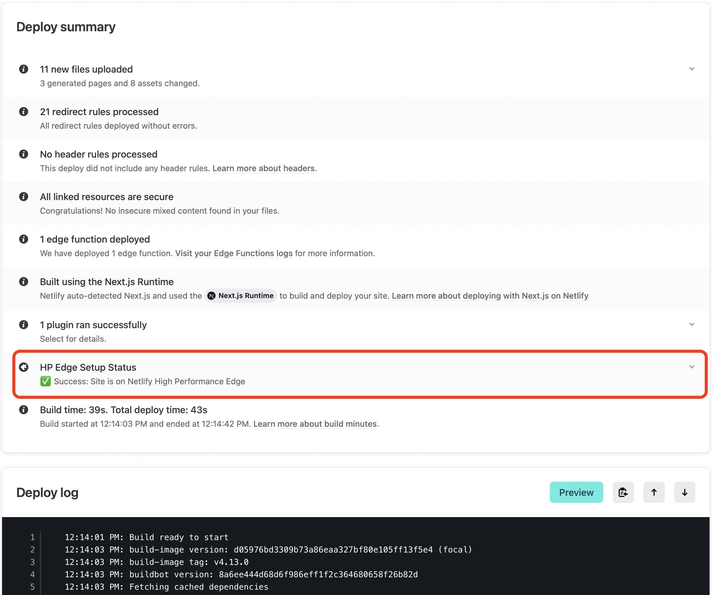

# Next starter app + Netlify Check HP Edge Enabled Build Plugin

This is a web app demo using a custom build plugin to check if HP Edge is enabled properly for the site. This is particularly useful when your domain is not managed by Netlify. It's using the starter [Next.js](https://nextjs.org/) project though you can use any framework. The build plugin runs as part of the Netlify build process and does the following:

1. The build plugin runs as part of the Netlify site build process (enabled by settings in netlify.toml file)
2. The plugin take the sites name (derived from the URL being built) and checks against a DNS server to confirm if the "CNAME" and "A" records are properly setup so that the site is served from the Netlify High Performance Edge network.
 Note: In some instances if there is another CDN configured from which the requests are proxied to Netlify the results may not be accurate.
3. The plugin will log the results in the build logs and the deploy summary.

## Setting up the demo
To try this plugin, click on 

(If you click this button, it will create a new repo for you that looks exactly like this one, and sets that repo up immediately for deployment on Netlify)

## Setting up this custom plugin for your web app
To add this custom plugin to your own web app, follow these the steps:
  1. Copy the following to your apps netlify.toml file

  [[context.production.plugins]]
  
  package = "/plugins/netlify-check-hpedge-enabled"

  2. At the root of your app create a directory: /plugins/netlify-check-hpedge-enabled/
  3. Copy files manifest.yml & index.js from this repo to your app

  ## Ideas to extend the capabilities...
  1. You can setup so that the build plugin stops the build process if HP Edge isn't setup correctly
  2. You can send an email/slack to inform your team with the status of the HP Edge check